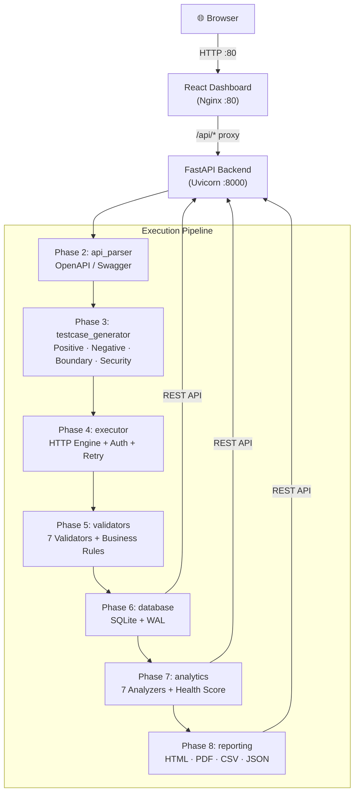
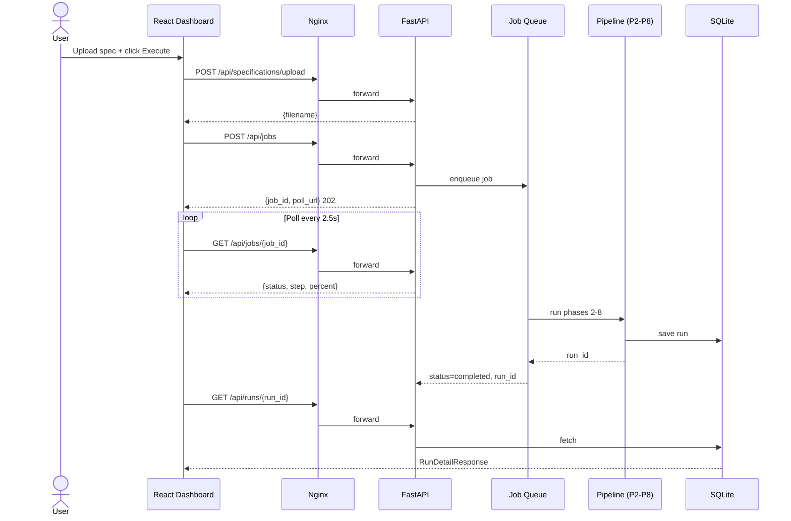

# API Test Studio

**Enterprise API Testing Platform — Specification-Driven, Fully Automated**

[](https://github.com/<YOUR_ORG>/api-testing-project/actions/workflows/ci.yml)
[](docker/README_COMPOSE.md)
[](requirements.txt)
[](web_dashboard/frontend/package.json)
[](web_dashboard/backend/)
[](#license)

> Replace `<YOUR_ORG>` with your GitHub username after pushing.

---

## Table of Contents

- [Overview](#overview)
- [Key Features](#key-features)
- [Technology Stack](#technology-stack)
- [Architecture](#architecture)
- [Folder Structure](#folder-structure)
- [Quick Start](#quick-start)
- [Docker](#docker)
- [Usage Guide](#usage-guide)
- [REST API](#rest-api)
- [Screenshots](#screenshots)
- [CI/CD](#cicd)
- [Documentation](#documentation)
- [Future Enhancements](#future-enhancements)
- [License](#license)
- [Author](#author)

---

## Overview

**API Test Studio** is a language-agnostic, specification-driven API testing platform built in Python and React. Upload any OpenAPI 3.x or Swagger 2.0 specification and the platform automatically generates hundreds of test cases, executes them against live APIs, validates the responses, persists the results, computes analytics, and generates professional reports — all without writing a single line of test code.

### Problems It Solves

| Problem | Solution |
|---|---|
| Writing API tests is slow and repetitive | Automatic test case generation from spec |
| Coverage is incomplete — happy path only | Positive, negative, boundary, and security tests generated automatically |
| Test results are hard to analyse | Built-in analytics engine with health scoring, trend analysis, and regression detection |
| Reports require manual effort | One-click HTML, PDF, CSV, and JSON report generation |
| Test setup is complex | Upload a spec, pick an environment, click Execute |
| Running locally vs CI is different | Docker Compose + GitHub Actions give identical environments |

### Target Users

- **API developers** who want fast automated regression testing
- **QA engineers** building test suites for REST APIs
- **Engineering teams** integrating API testing into CI/CD pipelines
- **Technical leaders** who want visibility into API health over time

---

## Key Features

### Core Testing Engine
- **OpenAPI 3.x & Swagger 2.0 parser** — JSON and YAML, full `$ref` resolution
- **Intelligent test case generator** — 4 categories, auto-deduplication
  - *Positive* — valid requests, all enum values, auth confirmation
  - *Negative* — missing params, wrong types, invalid auth, malformed body
  - *Boundary* — numeric min/max/zero, string length edges, empty/large arrays
  - *Security* — SQL injection, XSS, command injection, path traversal, oversized payloads
- **HTTP execution engine** — retry with exponential back-off, auth injection, SSL control
- **7-validator response engine** — status code, headers, response time, JSON structure, JSON Schema, exact match, business rules

### Persistence & Analytics
- **SQLite persistence** — WAL-mode, 5-table schema, 10 indexes, migration runner
- **Analytics engine** — 7 analyzers: health score (0–100), trend analysis, endpoint profiling, response time statistics (mean/p95/p99), failure distribution, regression detection
- **Run history** — compare any two runs, detect new/fixed/unchanged failures

### Reporting
- **HTML report** — interactive, self-contained, embedded Plotly charts
- **PDF report** — executive summary via ReportLab
- **CSV reports** — test results + validation details (Excel-compatible)
- **JSON report** — full structured export for downstream tooling

### Web Platform
- **FastAPI backend** — 19 REST endpoints, async job queue, Pydantic v2 validation
- **React dashboard** — MUI components, Plotly charts, 5 pages, responsive layout
- **Async execution** — non-blocking `POST /api/jobs` with live progress polling
- **Upload & Execute** — drag-and-drop spec upload → full pipeline in one click

### DevOps
- **Backend Docker image** — `python:3.12-slim`, 532 MB, health check
- **Frontend Docker image** — multi-stage, `nginx:1.27-alpine`, 55.6 MB, SPA routing
- **Docker Compose** — single-command startup, named volumes, health-dependent ordering
- **GitHub Actions CI** — 4-job parallel pipeline, 35 verification checks

---

## Technology Stack

### Backend
| Technology | Version | Purpose |
|---|---|---|
| Python | 3.12 | Core language |
| FastAPI | 0.139 | REST API framework |
| Uvicorn | 0.50 | ASGI server |
| Pydantic v2 | 2.13 | Request/response validation |
| SQLite | built-in | Persistence |
| Requests | 2.34 | HTTP execution engine |
| PyYAML | 6.0 | Spec parsing |
| jsonschema | 4.23 | JSON Schema validation |
| Jinja2 | 3.1 | HTML report templates |
| ReportLab | 4.2 | PDF generation |
| Plotly | 5.24 | Chart generation |
| Pillow | 12.3 | Image processing |
| aiofiles | 24.1 | Async file I/O |

### Frontend
| Technology | Version | Purpose |
|---|---|---|
| React | 18.3 | UI framework |
| TypeScript | 5.6 | Type safety |
| Vite | 6.0 | Build tool |
| Material UI | 6.1 | Component library |
| MUI X DataGrid | 7.22 | Data tables |
| react-plotly.js | 2.6 | Interactive charts |
| Axios | 1.7 | HTTP client |
| React Router | 6.28 | SPA navigation |

### DevOps & Infrastructure
| Technology | Purpose |
|---|---|
| Docker | Container packaging |
| Docker Compose | Multi-container orchestration |
| Nginx 1.27 | Frontend static serving + API proxy |
| GitHub Actions | CI/CD pipeline |

---

## Architecture



### Request Flow



---

## Folder Structure

```
API_Test_Studio/
│
├── app.py                       # CLI entry point — runs Phases 2–8 directly
├── requirements.txt             # Pinned Python dependencies (37 packages)
├── Dockerfile                   # Backend container (python:3.12-slim)
├── docker-compose.yml           # Full-platform orchestration
├── .env.example                 # Backend env var template
├── .env.docker.example          # Docker Compose env var template
│
├── configs/                     # YAML-driven configuration
│   ├── config.yaml              # App settings
│   └── environments.yaml        # Per-environment (dev / staging / prod)
│
├── constants/                   # All named constants — no magic strings
├── models/                      # Pure dataclasses: ApiSpec, Endpoint, TestCase, ExecutionResult
├── interfaces/                  # Abstract base classes: ISpecParser, IValidator, ITestCaseGenerator
├── exceptions/                  # Typed exception hierarchy per layer
├── utilities/                   # LoggerFactory, file I/O helpers, UUID/timestamp generators
│
├── api_parser/                  # Phase 2 — OpenAPI 3.x + Swagger 2.0 parser
│   ├── openapi_parser.py
│   ├── swagger_parser.py
│   ├── parser_factory.py        # Strategy registry
│   └── parser_manager.py        # Public façade
│
├── testcase_generator/          # Phase 3 — 4-category test case generator
│   ├── positive_generator.py
│   ├── negative_generator.py
│   ├── boundary_generator.py
│   ├── security_generator.py
│   └── generator_manager.py
│
├── executor/                    # Phase 4 — HTTP execution engine
│   ├── execution_manager.py
│   ├── request_manager.py
│   ├── authentication_manager.py
│   ├── retry_handler.py
│   ├── url_builder.py
│   └── payload_builder.py
│
├── validators/                  # Phase 5 — 7-validator response engine
│   ├── status_code_validator.py
│   ├── header_validator.py
│   ├── response_time_validator.py
│   ├── json_validator.py
│   ├── schema_validator.py
│   ├── exact_response_validator.py
│   ├── business_rule_validator.py
│   └── validation_manager.py
│
├── database/                    # Phase 6 — SQLite persistence
│   ├── schema.py                # DDL — 5 tables, 10 indexes
│   ├── migrations.py            # Version-tracked migration runner
│   ├── models.py                # DB dataclasses
│   ├── repository.py            # SQL hidden here
│   ├── sqlite_manager.py        # WAL-mode connection manager
│   └── database_manager.py      # Public façade
│
├── analytics/                   # Phase 7 — 7-analyzer analytics engine
│   ├── health_analyzer.py       # Composite 0–100 health score
│   ├── trend_analyzer.py        # Pass rate / RT trends, daily/weekly/monthly
│   ├── endpoint_analyzer.py     # Per-endpoint statistics
│   ├── response_time_analyzer.py# Mean / median / p95 / p99 / SLA compliance
│   ├── failure_analyzer.py      # Distribution by category, top-10 messages
│   ├── regression_analyzer.py   # New / fixed / unchanged failures
│   └── analytics_manager.py     # Public façade → AnalyticsSummary
│
├── reporting/                   # Phase 8 — 5-format reporting engine
│   ├── html_generator.py        # Interactive self-contained HTML
│   ├── pdf_generator.py         # Executive PDF via ReportLab
│   ├── csv_generator.py         # Two CSVs (results + validation details)
│   ├── json_generator.py        # Structured JSON export
│   ├── chart_generator.py       # Plotly chart builders
│   ├── template_loader.py       # Jinja2 + custom filters
│   └── report_manager.py        # Public façade
│
├── web_dashboard/
│   ├── backend/                 # Phase 9 — FastAPI REST API
│   │   ├── main.py              # App factory, CORS, middleware, lifespan
│   │   ├── routers/             # health, specs, jobs, runs, analytics, reports, results
│   │   ├── schemas/             # Pydantic v2 request/response models
│   │   ├── services/            # job_store.py, pipeline_runner.py
│   │   ├── dependencies/        # FastAPI Depends() providers
│   │   ├── middleware/          # Request timing + structured access log
│   │   └── config/              # Settings singleton
│   │
│   └── frontend/                # Phase 10 — React dashboard
│       ├── src/
│       │   ├── pages/           # Dashboard, Upload, Runs, RunDetail, Analytics
│       │   ├── components/      # StatCard, SectionCard, StatusChip, PageState
│       │   ├── components/charts/ # PassFailPie, HealthGauge, EndpointPassRateBar…
│       │   ├── services/        # apiClient, runsService, analyticsService…
│       │   ├── hooks/           # useAsync
│       │   ├── types/           # TypeScript interfaces (api.ts, upload.ts)
│       │   └── layouts/         # MainLayout (AppBar + sidebar)
│       ├── Dockerfile           # Multi-stage: node:22-slim → nginx:1.27-alpine
│       └── nginx.conf           # SPA routing, gzip, security headers, /api proxy
│
├── uploaded_specs/              # Spec upload landing zone
├── reports/                     # Generated report output
├── history/                     # Run export files (JSON + CSV)
├── database/                    # SQLite database file
├── templates/                   # Jinja2 HTML report templates
│
├── docker/                      # Docker documentation
│   ├── README_BACKEND.md
│   ├── README_FRONTEND.md
│   └── README_COMPOSE.md
│
├── docs/                        # Full documentation suite
│   ├── ARCHITECTURE.md
│   ├── INSTALLATION.md
│   ├── API_REFERENCE.md
│   ├── USER_GUIDE.md
│   ├── DEVELOPER_GUIDE.md
│   ├── DEPLOYMENT.md
│   └── RELEASE_CHECKLIST.md
│
└── .github/
    └── workflows/
        └── ci.yml               # 4-job CI pipeline
```

---

## Quick Start

### Prerequisites

| Tool | Version |
|---|---|
| Python | 3.12+ |
| Node.js | 22+ |
| Docker | 24+ (optional) |

### Local Installation

```bash
# 1. Clone
git clone https://github.com/<YOUR_ORG>/api-testing-project.git
cd api-testing-project/API_Test_Studio

# 2. Python environment
python -m venv .venv
source .venv/bin/activate          # Windows: .venv\Scripts\activate
pip install -r requirements.txt

# 3. Backend
uvicorn web_dashboard.backend.main:app --reload --port 8000
# → http://127.0.0.1:8000/docs

# 4. Frontend (new terminal)
cd web_dashboard/frontend
npm install
npm run dev
# → http://localhost:5173
```

### CLI Mode (no web server)

```bash
# Drop a spec into uploaded_specs/ then:
python app.py
# Runs all 8 phases and writes reports to reports/
```

---

## Docker

```bash
# Backend only
docker build -t api-test-studio-backend .
docker run -p 8000:8000 api-test-studio-backend

# Frontend only
cd web_dashboard/frontend
docker build -t api-test-studio-frontend .
docker run -p 80:80 api-test-studio-frontend
```

See [`docker/README_BACKEND.md`](docker/README_BACKEND.md) and [`docker/README_FRONTEND.md`](docker/README_FRONTEND.md) for full options.

---

## Docker Compose (Recommended)

```bash
# Copy env file and start everything
cp .env.docker.example .env
docker compose up --build

# Dashboard  → http://localhost
# API docs   → http://localhost:8000/docs
```

```bash
# Stop (data persists in named volumes)
docker compose down

# Wipe all data
docker compose down -v
```

See [`docker/README_COMPOSE.md`](docker/README_COMPOSE.md) for the full guide.

---

## Usage Guide

### 1 — Upload a Specification

Navigate to **Upload** in the sidebar. Drag and drop (or browse) any:
- OpenAPI 3.x JSON or YAML
- Swagger 2.0 JSON or YAML

Sample specs are included in `uploaded_specs/`.

### 2 — Configure and Execute

Select the target environment (`development` / `staging` / `production`), optionally override the base URL, then click **Execute Pipeline**. The platform runs all 8 phases asynchronously and streams live progress.

### 3 — View Results

When execution completes, click **View Run** to see:
- Pass/fail breakdown with a progress bar
- Per-endpoint statistics table
- Pass vs Fail pie chart
- Failure distribution bar chart
- Health Score gauge
- Per-validator assertion breakdown
- Actionable recommendations

### 4 — Explore Analytics

The **Analytics** page shows the full `AnalyticsSummary` for any run:
- Health score (0–100 with component scores)
- Response time statistics (mean, median, p95, p99, SLA compliance)
- Endpoint performance table with sorting
- Failure distribution
- Trend direction (improving / stable / degrading)
- Regression summary vs a baseline run

### 5 — Download Reports

From any Run Detail page, click **Reports** to download:
- `Execution_Report.html` — self-contained interactive dashboard
- `Execution_Report.pdf` — executive summary
- `Execution_Report_results.csv` — all test case results
- `Execution_Report_validation.csv` — per-assertion detail
- `Execution_Report.json` — full structured export

---

## REST API

Base URL: `http://localhost:8000`  
Interactive docs: `http://localhost:8000/docs`

### Health

| Method | Path | Description |
|---|---|---|
| `GET` | `/` | Service identity |
| `GET` | `/api/health` | Component health probe |

### Specifications

| Method | Path | Description |
|---|---|---|
| `POST` | `/api/specifications/upload` | Upload a Swagger/OpenAPI file |
| `GET` | `/api/specifications` | List all uploaded specs |
| `GET` | `/api/specifications/{filename}` | Parse and return spec metadata |

### Async Jobs (Phase 9.3)

| Method | Path | Description |
|---|---|---|
| `POST` | `/api/jobs` | Submit a pipeline job (returns 202) |
| `GET` | `/api/jobs/{job_id}` | Poll status and progress |
| `GET` | `/api/jobs` | List all in-memory jobs |
| `DELETE` | `/api/jobs/{job_id}` | Cancel a pending job |

### Runs

| Method | Path | Description |
|---|---|---|
| `POST` | `/api/run` | Execute pipeline synchronously |
| `GET` | `/api/runs` | Paginated run history |
| `GET` | `/api/runs/{run_id}` | Full run detail + validation summary |

### Results

| Method | Path | Description |
|---|---|---|
| `GET` | `/api/runs/{run_id}/results/summary` | Aggregated breakdown |
| `GET` | `/api/runs/{run_id}/results` | Filtered + paginated results |
| `GET` | `/api/runs/{run_id}/results/{result_id}` | Single result + all assertion details |

### Analytics

| Method | Path | Description |
|---|---|---|
| `GET` | `/api/analytics` | Analytics for the latest run |
| `GET` | `/api/analytics/{run_id}` | Full AnalyticsSummary for a run |

### Reports

| Method | Path | Description |
|---|---|---|
| `GET` | `/api/reports/{run_id}` | List generated reports for a run |
| `GET` | `/api/reports/{run_id}/download/{filename}` | Download a report file |

Full request/response documentation: [`docs/API_REFERENCE.md`](docs/API_REFERENCE.md)

---

## Screenshots

> Add screenshots after first deployment. Suggested tools: macOS Screenshot, ShareX, or a browser extension.

| Page | Screenshot |
|---|---|
| Dashboard |  |
| Upload & Execute |  |
| Run Details |  |
| Analytics |  |
| Swagger UI |  |
| Docker Compose |  |

*Screenshots directory: `docs/screenshots/` — add PNG files to activate the images above.*

---

## CI/CD

GitHub Actions runs automatically on every push and pull request to `main`, `master`, and `develop`.

```
push / pull_request
       │
       ├── backend  — Python 3.12 imports, FastAPI startup, schema validation
       ├── frontend — npm ci, TypeScript check (0 errors), production build
       └── docker   — compose syntax, backend build, frontend build, nginx -t
              │
              └── ci-gate — blocks merge if any job fails
```

**Artifacts uploaded per run:**
- `backend-verification-<N>` — import + endpoint summary (30 days)
- `frontend-dist-<N>` — production build output (7 days)

Pipeline definition: [`.github/workflows/ci.yml`](.github/workflows/ci.yml)

---

## Documentation

| Document | Description |
|---|---|
| [`docs/ARCHITECTURE.md`](docs/ARCHITECTURE.md) | Component diagrams, module responsibilities, all data flows |
| [`docs/INSTALLATION.md`](docs/INSTALLATION.md) | Local, Docker, and Compose setup with troubleshooting |
| [`docs/API_REFERENCE.md`](docs/API_REFERENCE.md) | Every endpoint: request, response, status codes, curl examples |
| [`docs/USER_GUIDE.md`](docs/USER_GUIDE.md) | End-to-end workflow walkthrough |
| [`docs/DEVELOPER_GUIDE.md`](docs/DEVELOPER_GUIDE.md) | Project structure, coding standards, how to extend |
| [`docs/DEPLOYMENT.md`](docs/DEPLOYMENT.md) | Production deployment, Docker, Compose, CI/CD |
| [`docs/RELEASE_CHECKLIST.md`](docs/RELEASE_CHECKLIST.md) | Pre-release verification checklist |
| [`docker/README_COMPOSE.md`](docker/README_COMPOSE.md) | Full Docker Compose reference |

---

## Future Enhancements

| Enhancement | Description |
|---|---|
| AI test generation | LLM-assisted edge case discovery and payload mutation |
| AI failure analysis | Automatic root cause classification using model inference |
| Authentication | JWT-based user accounts, API key management |
| PostgreSQL support | Drop-in replacement for SQLite via SQLAlchemy |
| Postman / RAML parser | Additional spec format support |
| WebSocket progress | Replace polling with real-time job updates |
| Kubernetes deployment | Helm chart for cloud-native operation |
| Plugin system | Third-party validator and reporter plugins |

---

## License

```
MIT License

Copyright (c) 2026 API Test Studio

Permission is hereby granted, free of charge, to any person obtaining a copy
of this software and associated documentation files (the "Software"), to deal
in the Software without restriction, including without limitation the rights
to use, copy, modify, merge, publish, distribute, sublicense, and/or sell
copies of the Software.
```

---

## Author

**API Test Studio** was designed and built as a full-stack enterprise platform demonstrating end-to-end software engineering across:

- **Backend architecture** — modular pipeline, clean interfaces, typed dataclasses
- **REST API design** — FastAPI, Pydantic v2, async job queue, pagination
- **Frontend engineering** — React, TypeScript, MUI, Plotly, React Router
- **Data engineering** — SQLite WAL, migration runner, repository pattern
- **DevOps** — multi-stage Docker builds, Compose orchestration, GitHub Actions CI
- **Software quality** — 7 validators, analytics engine, production readiness audit

---

*Built with Python 3.12 · FastAPI · React 18 · TypeScript · Docker · GitHub Actions*
