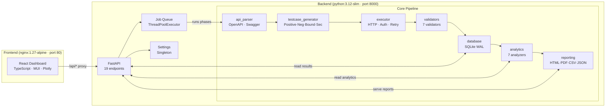
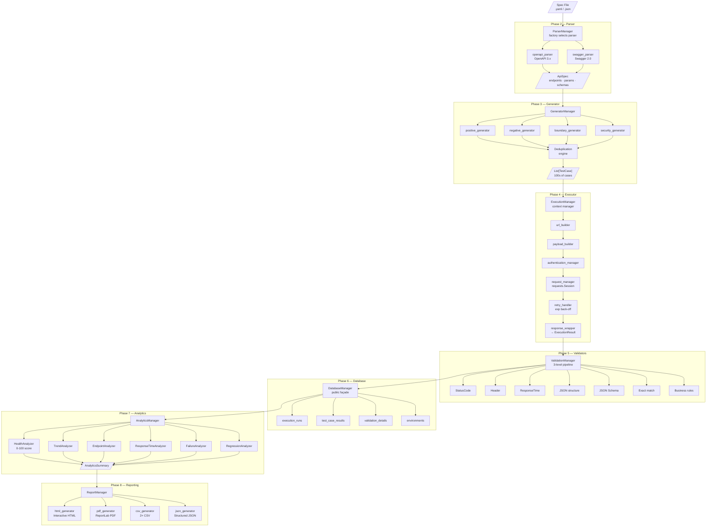
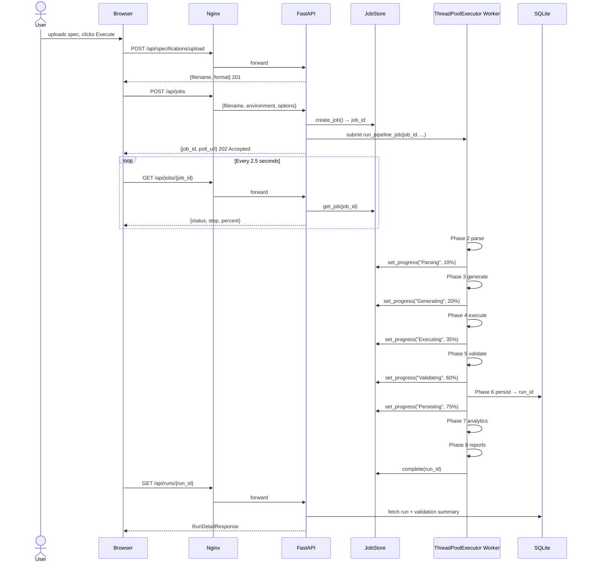
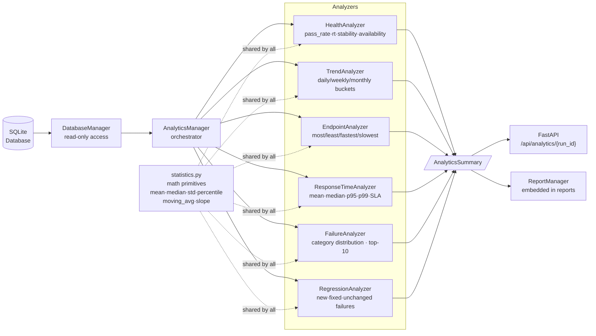
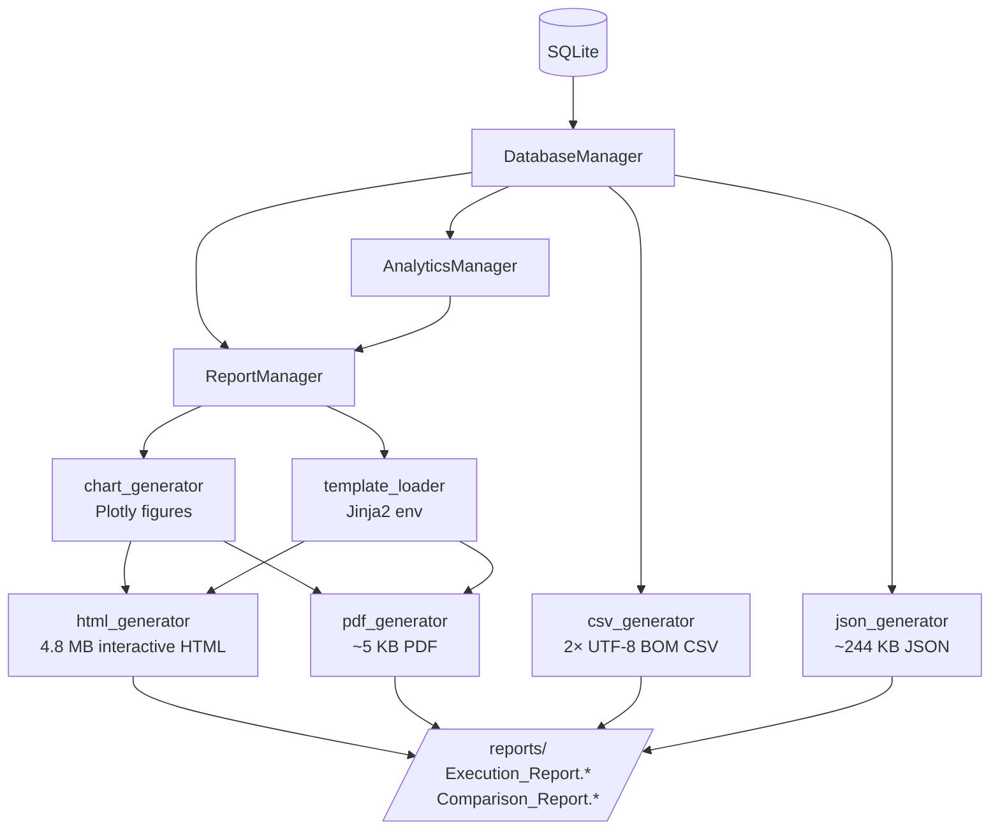
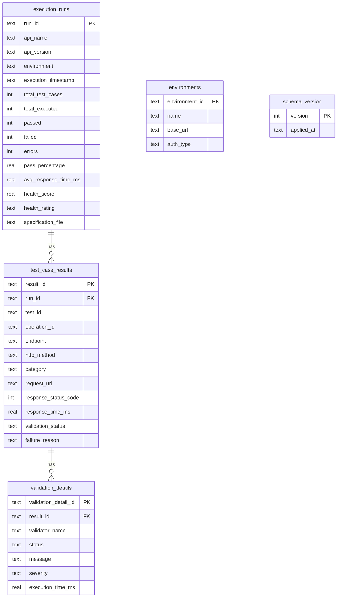
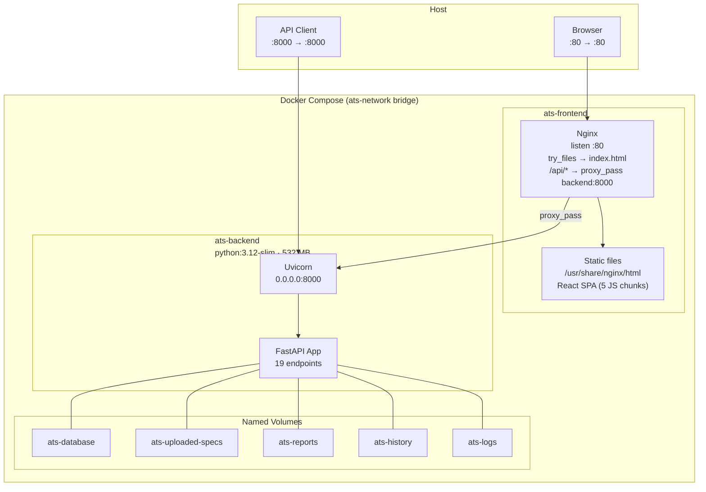

# Architecture — API Test Studio

This document describes the internal structure, component responsibilities, and all major data flows of the API Test Studio platform.

---

## Table of Contents

- [High-Level Overview](#high-level-overview)
- [Component Diagram](#component-diagram)
- [Module Responsibilities](#module-responsibilities)
- [Execution Pipeline (Phases 2–8)](#execution-pipeline-phases-28)
- [Request Flow (Async Job)](#request-flow-async-job)
- [Analytics Flow](#analytics-flow)
- [Reporting Flow](#reporting-flow)
- [Data Model Relationships](#data-model-relationships)
- [Docker Architecture](#docker-architecture)
- [Design Principles](#design-principles)

---

## High-Level Overview

API Test Studio follows a **layered pipeline architecture**. Each phase is a self-contained module that reads from the phase before it and writes to the phase after it. No phase bypasses another.

```
Specification File
        │
        ▼
  ┌──────────┐
  │ Parser   │  api_parser/         — OpenAPI 3.x + Swagger 2.0 → ApiSpec
  └────┬─────┘
       │ ApiSpec
       ▼
  ┌────────────┐
  │ Generator  │  testcase_generator/ — ApiSpec → List[TestCase]
  └─────┬──────┘
        │ List[TestCase]
        ▼
  ┌──────────┐
  │ Executor │  executor/           — TestCase → ExecutionResult (live HTTP)
  └────┬─────┘
       │ List[ExecutionResult]
       ▼
  ┌────────────┐
  │ Validators │  validators/        — ExecutionResult → ValidationResult
  └─────┬──────┘
        │ List[ValidationResult]
        ▼
  ┌──────────┐
  │ Database │  database/           — All results persisted to SQLite
  └────┬─────┘
       │ run_id
       ▼
  ┌──────────────┐
  │  Analytics   │  analytics/      — DatabaseManager → AnalyticsSummary
  └──────┬───────┘
         │ AnalyticsSummary
         ▼
  ┌──────────┐
  │ Reporting│  reporting/          — Reports: HTML · PDF · CSV · JSON
  └──────────┘
```

---

## Component Diagram



---

## Module Responsibilities

### Infrastructure Modules

| Module | Responsibility |
|---|---|
| `configs/` | Single source of truth for all configuration. `Config` loads `config.yaml` and `environments.yaml`. No hardcoded values exist anywhere else. |
| `constants/` | All named constants: `HttpMethod`, `HttpStatus`, `SpecFormat`, `ValidationType`, `AppMeta`, `FilePaths`. No magic strings outside this module. |
| `models/` | Pure immutable dataclasses: `ApiSpec`, `Endpoint`, `Parameter`, `TestCase`, `Assertion`, `ExecutionResult`, `AssertionResult`. No business logic. |
| `interfaces/` | Abstract base classes that enforce contracts: `ISpecParser`, `IValidator`, `ITestCaseGenerator`. All implementations must satisfy these. |
| `exceptions/` | Typed exception hierarchy per layer: `ConfigurationError`, `ParserError`, `ExecutionError`, `ValidationError`. |
| `utilities/` | Shared helpers: `LoggerFactory` (ANSI colour + rotating file), file I/O, UUID/timestamp/slug generators. |

### Phase Modules

| Phase | Module | Input | Output |
|---|---|---|---|
| 2 | `api_parser/` | Spec file path | `ApiSpec` |
| 3 | `testcase_generator/` | `ApiSpec` + `EnvironmentConfig` | `List[TestCase]` |
| 4 | `executor/` | `List[TestCase]` + `EnvironmentConfig` | `List[ExecutionResult]` |
| 5 | `validators/` | `List[TestCase]` + `List[ExecutionResult]` | `List[ValidationResult]` |
| 6 | `database/` | All Phase 2–5 outputs + `Config` | `run_id` (str) |
| 7 | `analytics/` | `DatabaseManager` + `run_id` | `AnalyticsSummary` |
| 8 | `reporting/` | `DatabaseManager` + `AnalyticsManager` + `run_id` | Report files |

---

## Execution Pipeline (Phases 2–8)



---

## Request Flow (Async Job)

The async job queue (Phase 9.3) decouples HTTP request handling from the long-running pipeline.



---

## Analytics Flow



---

## Reporting Flow



---

## Data Model Relationships



---

## Docker Architecture



---

## Design Principles

| Principle | Application |
|---|---|
| **Single Responsibility** | Every class does one thing. `RequestManager` sends requests. `RetryHandler` manages retries. `ResponseWrapper` converts responses. |
| **Open/Closed** | New parsers implement `ISpecParser` without touching existing code. New validators implement `IValidator`. |
| **Façade Pattern** | Every phase exposes a single manager class (`ParserManager`, `GeneratorManager`, etc.) hiding all internal complexity. |
| **Repository Pattern** | `ExecutionRepository`, `TestCaseRepository`, `ValidationRepository` hide all SQL. `DatabaseManager` is the only public interface. |
| **No Magic Strings** | Every literal is a named constant in `constants/`. |
| **No Hardcoded Config** | Every configurable value comes from `configs/config.yaml` or `configs/environments.yaml`. |
| **Dependency Inversion** | High-level modules (`executor`) depend on abstractions (`ISpecParser`), not concrete implementations. |
| **Layered Independence** | Each phase can be unit-tested in isolation. Phases 2–5 have no database dependency. |
